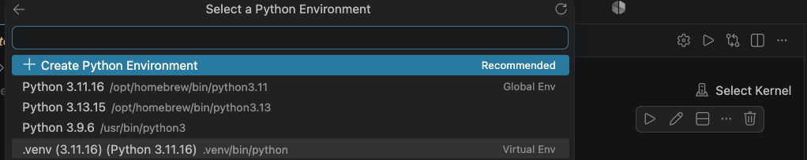
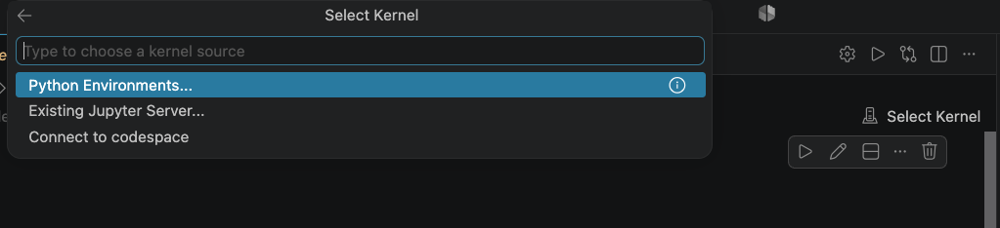

# Microsoft Foundry Agent Workshop

**Learning objective:** Build the same support agent in the Foundry portal and with
code using the Python SDK.

## Before You Begin

Complete the [participant prerequisites](docs/prerequisites/participants.md), then
open this repository in Visual Studio Code.

You need Python 3.11, Azure CLI, Git, and the Visual Studio Code **Python** and
**Jupyter** extensions. The workshop host provides the non-secret Foundry values and
assigns **Foundry Project Manager** access at the workshop Foundry resource scope.

### Set Up Your Environment

Clone the workshop repository and open its directory:

```bash
git clone https://github.com/OmriNor/foundry-workshop.git
cd foundry-workshop
```

#### macOS and Linux

```bash
python3.11 -m venv .venv
.venv/bin/python -m pip install -r requirements.txt
cp .env.example .env
```

#### Windows PowerShell

```powershell
python -3.11 -m venv .venv
.\.venv\Scripts\python.exe -m pip install -r requirements.txt
Copy-Item .env.example .env
```

### Configure `.env`

Open `.env` and enter the values supplied by the workshop host for:

```dotenv
AZURE_SUBSCRIPTION_ID=
AZURE_RESOURCE_GROUP=
FOUNDRY_RESOURCE_NAME=
FOUNDRY_PROJECT_NAME=
FOUNDRY_PROJECT_ENDPOINT=
MODEL_DEPLOYMENT_NAME=
PUBLIC_MCP_ENDPOINT=
```

Set `PARTICIPANT_ID` to your lowercase name, for example `omri`. Before creating
resources, check that the prefix is not already in use. Append a number only when
needed, for example `omri-2`.

Keep `.env` local. Do not commit it, share it in chat, or add credentials to it.

### Sign In and Check Your Setup

Sign in with your own Microsoft Entra account:

```bash
az login
```

### Select the Python Interpreter and Notebook Kernel

In Visual Studio Code:

1. Open the Command Palette with **Cmd+Shift+P** on macOS or **Ctrl+Shift+P** on
   Windows.
2. Select **Python: Select Interpreter**.
3. Select the Python 3.11 interpreter in this repository's `.venv`:
   `.venv/bin/python` on macOS/Linux or `.venv\\Scripts\\python.exe` on Windows.
   The selected interpreter appears in the VS Code status bar.

   

4. In the Code/SDK labs (when you open a specific Jupyter notebook lab) in the notebook editor, select
   **Select Kernel** in the upper-right corner.
5. Select **Python Environments**, then select the same `.venv` Python 3.11
   interpreter. If VS Code asks for a Jupyter server, use the default local server.

   

The interpreter and notebook kernel must both point to this repository's `.venv` so
the notebooks use the packages installed for the workshop. Then run the local
environment check:

```bash
.venv/bin/python scripts/check_environment.py
```

On Windows PowerShell, run:

```powershell
.\.venv\Scripts\python.exe scripts/check_environment.py
```

The check verifies local tools, configuration presence, your participant identifier,
and HTTPS endpoint format without printing configuration values.

## Workshop Flow

Complete each part in order. The portal path gives you one complete agent lifecycle
before you reproduce the same capabilities with the SDK.

### Part 1: Portal Workshop

Complete the [Portal Workshop](labs/portal-labs/README.md) from start to finish. You
will create one portal agent, ground it with files, add an MCP tool, and evaluate it.

1. [Lab 1: Create the Support Agent](labs/portal-labs/01-create-agent/README.md)
2. [Lab 2: Ground the Support Agent with Files](labs/portal-labs/02-file-grounding/README.md)
3. [Lab 3: Add an MCP Tool](labs/portal-labs/03-mcp-tools/README.md)
4. [Lab 4: Evaluate the Enhanced Agent](labs/portal-labs/04-evaluation/README.md)

Portal resources use your normal `<PARTICIPANT_ID>-...` prefix. For example, the
baseline portal agent for `omri` is `omri-agent-baseline`.

### Part 2: Code and SDK Workshop

After you complete the portal flow, open the [Code and SDK Workshop](labs/code-labs/README.md).
The four notebooks independently recreate the baseline agent, grounding, MCP, and
multi-tool capabilities through the Python SDK:

1. [Lab 1 SDK: Create the Support Agent](labs/code-labs/01-create-agent/create-agent.ipynb)
2. [Lab 2 SDK: Ground the Support Agent with Files](labs/code-labs/02-file-grounding/file-grounding.ipynb)
3. [Lab 3 SDK: Add an MCP Tool](labs/code-labs/03-mcp-tools/mcp-tools.ipynb)
4. [Lab 4 SDK: Combine Local Functions and Web Search](labs/code-labs/04-multi-tools/multi-tools.ipynb)

SDK notebooks automatically use `<PARTICIPANT_ID>-ws-...`, so the SDK baseline agent
for `omri` is `omri-ws-agent-baseline`.

## Portal and SDK Mapping

Portal and SDK prompt agents use the same Foundry-managed runtime. The portal
accelerates interactive configuration and testing; the SDK makes the same
configuration repeatable, reviewable, automatable, and integrable with applications.

## Participant Naming

Participant-scoped resources use a lowercase version of the participant's name as
the prefix (for example `omri`). Before creating resources, check that the prefix is
not already in use; append a number when needed (for example `omri-2`). This keeps
resource names scoped to one participant.
